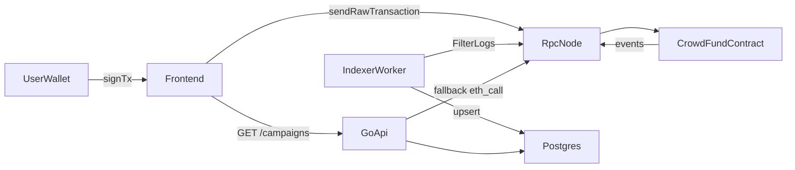

# Crowdfunding DApp (Foundry + Go + Ethers)

一个面向学习的众筹项目完整样板：包含 Solidity 合约、Foundry 测试与部署脚本、Go 后端索引/API、以及 Sepolia 钱包交互前端。

## 功能概览

- 创建众筹活动 `createCampaign`
- 用户捐款 `fund`
- 达标后项目方提款 `withdraw`
- 未达标时捐款人退款 `refund`
- 后端事件索引（CampaignCreated/Funded/Withdrawn/Refunded）
- 查询 API（活动列表、活动详情、地址捐款查询）

## 架构图



## 仓库结构

```text
src/                 Solidity 合约
test/                Foundry 测试
script/              Foundry 部署脚本
backend/             Go 后端（indexer + api + migrations）
frontend/            最小钱包交互页面（Sepolia）
```

## 快速开始

### 1) 合约（Foundry）

```bash
~/.foundry/bin/forge build
~/.foundry/bin/forge test -vv
```

本地部署（Anvil）：

```bash
~/.foundry/bin/anvil
~/.foundry/bin/forge script script/DeployCrowdFund.s.sol:DeployCrowdFundScript \
  --rpc-url http://127.0.0.1:8545 \
  --private-key <ANVIL_PRIVATE_KEY> \
  --broadcast
```

### 2) 后端（Go）

进入 `backend/` 后：

```bash
go mod tidy
```

执行数据库初始化（`backend/migrations/001_init.sql`），再配置：

- `DATABASE_URL`
- `CHAIN_CONFIG_PATH`（默认 `config/chain.testnet.example.json`）

启动服务：

```bash
go run ./cmd/indexer
go run ./cmd/api
```

### 3) 前端（Sepolia）

前端目录是 `frontend/`，可以直接静态打开或本地起服务：

```bash
npx serve frontend
```

页面中输入合约地址，点击连接钱包（会检查/切换 Sepolia），即可执行：

- `createCampaign`
- `fund`
- `withdraw`
- `refund`

## 演示流程（推荐）

1. 部署合约到 Sepolia
2. 前端创建活动（`createCampaign`）
3. 用另一个地址捐款（`fund`）
4. 索引器同步事件到数据库
5. API 查询活动列表/详情
6. 到期后根据达标与否执行 `withdraw` 或 `refund`

## 界面预览

把截图放到 `docs/screenshots/` 后，取消下面注释即可：

```md


```

## 开发说明

- 合约核心文件：`src/CrowdFund.sol`
- 合约测试：`test/CrowdFund.t.sol`
- 后端说明：`backend/README.md`
- 前端说明：`frontend/README.md`

## 后续扩展建议

- 活动取消 `cancelCampaign`
- ERC20 众筹
- 平台手续费
- 分页/筛选/统计 API
- 前端活动详情页与交易历史页
