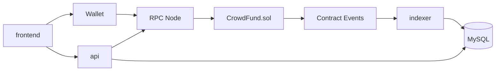

# Crowdfunding DApp

一个基于 Foundry、Go、MySQL 和静态前端的众筹 DApp 示例项目。

## 项目组成

- `src/`：Solidity 合约
- `test/`：Foundry 测试
- `script/`：部署脚本
- `backend/`：API、indexer、数据库迁移
- `frontend/`：静态钱包交互页面
- `docs/`：项目说明、部署与开发文档
- `security/`：安全说明、权限矩阵、已知风险
- `monitoring/`：运行观测与告警建议
- `audits/`：审计与评审记录占位
- `.claude/`：团队协作提示、项目上下文与本地配置示例

## 核心功能

- 创建众筹活动 `createCampaign`
- 用户捐款 `fund`
- 达标后创建者提现 `withdraw`
- 失败后捐款人退款 `refund`
- 后端索引链上事件并提供查询 API

## 架构概览



## 快速入口

- 项目介绍：[docs/PROJECT_INTRO.md](docs/PROJECT_INTRO.md)
- 文档索引：[docs/README.md](docs/README.md)
- 架构说明：[docs/ARCHITECTURE.md](docs/ARCHITECTURE.md)
- 新人上手：[docs/ONBOARDING.md](docs/ONBOARDING.md)
- 开发启动：[docs/START_FROM_ZERO.md](docs/START_FROM_ZERO.md)
- 部署说明：[docs/DEPLOYMENT.md](docs/DEPLOYMENT.md)
- 配置说明：[backend/config/README.md](backend/config/README.md)
- 安全说明：[security/README.md](security/README.md)
- Claude 协作说明：[.claude/README.md](.claude/README.md)

## 本地开发

### 合约

```bash
forge build
forge test -vv
```

### 后端

进入 `backend/` 后配置以下环境变量：

- `DATABASE_URL`
- `CHAIN_CONFIG_PATH`

然后启动：

```bash
go run ./cmd/indexer
go run ./cmd/api
```

### 前端

```bash
npx serve frontend
```

## 推荐阅读顺序

1. `src/CrowdFund.sol`
2. `test/CrowdFund.t.sol`
3. `script/DeployCrowdFund.s.sol`
4. `backend/internal/indexer/sync.go`
5. `backend/internal/store/`
6. `backend/internal/chain/`
 7. `docs/PROJECT_INTRO.md`
 8. `docs/ARCHITECTURE.md`

## 仓库约定

- 链上合约是资金与状态真相源
- 前端直接发交易，后端不代签
- API 以数据库读取为主，必要时回链上兜底
- indexer 与 API 保持独立进程
- 修改数据库结构时同步维护 `backend/migrations/`
- 修改部署方式时同步维护 `docs/DEPLOYMENT.md`
