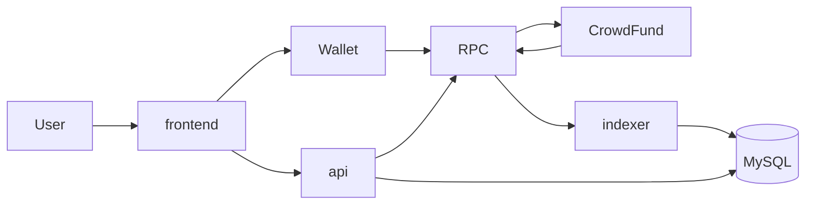
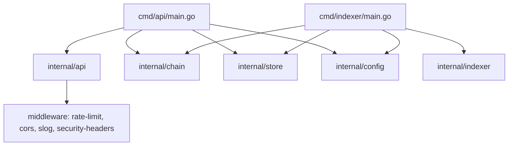
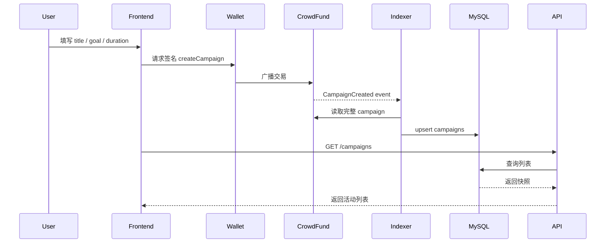
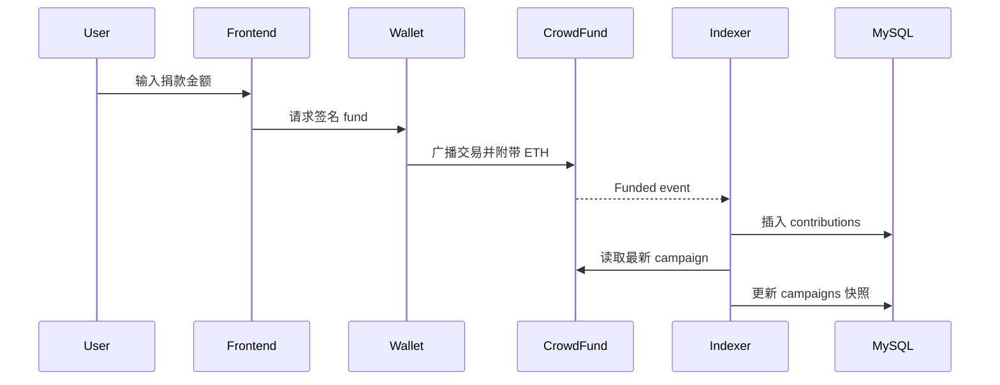
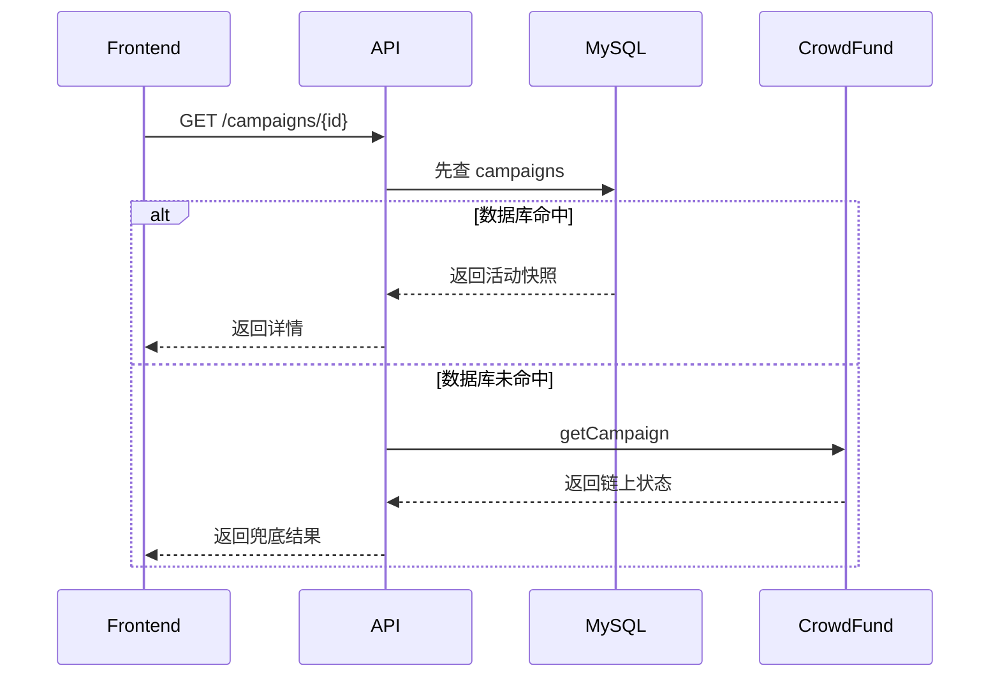

# 架构说明

本文档聚焦系统结构、职责边界和几条关键时序，适合在开始改代码前快速建立全局认知。

## 1. 系统结构

项目由四个运行角色组成：

1. 前端 `frontend`
2. 智能合约 `src/CrowdFund.sol`
3. 查询服务 `backend/cmd/api`
4. 索引服务 `backend/cmd/indexer`

再加一个持久化组件：

5. `mysql`

## 2. 高层关系

## 3. 模块边界

### 前端

- 负责连接钱包
- 负责发起交易
- 负责调用 API 展示活动列表和详情
- 不托管私钥

### 合约

- 负责资金流转
- 负责活动状态
- 负责发出链上事件
- 是唯一的业务真相源

### API

- 负责读数据库
- 在数据库未命中时回链上兜底
- 不广播用户交易
- 内置限流、安全头、结构化日志
- 提供 `/api/v1/` 版本化路由和 `/api/v1/stats` 统计端点

### Indexer

- 负责扫描合约事件
- 负责更新活动快照和事件表
- 不参与业务决策

### MySQL

- 保存活动快照
- 保存贡献、退款、提现事件
- 保存 indexer checkpoint

## 4. 后端内部结构

## 5. 创建活动时序

## 6. 捐款时序

## 7. 查询详情时序

## 8. 为什么要 API 和 Indexer 分离

- API 偏请求响应
- Indexer 偏持续同步
- 同步失败不应拖垮查询服务
- 查询扩容和追块扩容的策略不同

## 9. 数据模型思路

数据库不是只存事件，也存快照：

- `campaigns`：当前状态快照
- `contributions`：捐款明细
- `refunds`：退款明细
- `withdrawals`：提现明细
- `indexer_checkpoints`：同步进度

这样设计的好处：

- 列表查询轻
- 详情查询快
- 历史事件仍可审计

## 10. 改动联动规则

- 改合约事件：检查 indexer、store、前端 ABI
- 改数据库字段：补 migration
- 改配置路径：同步更新 `.env.example`、compose、文档
- 改 API 响应结构：同步检查前端调用

## 11. 推荐阅读顺序

1. `docs/PROJECT_INTRO.md`
2. `docs/ARCHITECTURE.md`
3. `src/CrowdFund.sol`
4. `test/CrowdFund.t.sol`
5. `backend/internal/indexer/sync.go`
6. `backend/internal/store/`
7. `backend/internal/api/`

## 12. 相关文档

- [项目介绍](PROJECT_INTRO.md)
- [文档索引](README.md)
- [从零启动](START_FROM_ZERO.md)
- [部署说明](DEPLOYMENT.md)
- [新人上手](ONBOARDING.md)
