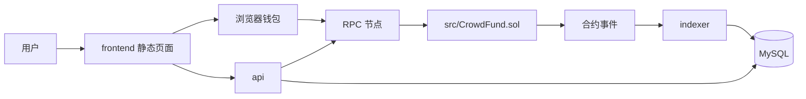

# Crowdfunding 项目介绍

本文档面向第一次接手这个仓库的开发者，目标是说明这个项目是什么、由哪些模块组成、模块之间如何配合，以及一笔完整业务是怎样从前端流到链上、再流回后端查询接口的。

## 1. 项目定位

这是一个典型的众筹 DApp，采用“链上资金结算 + 链下事件索引 + 静态前端交互”的组合架构。

项目分成 4 个核心部分：

1. Solidity 合约
2. Go 后端 API
3. Go 链上事件索引器
4. 静态前端页面

它解决的问题很明确：

- 发起人可以创建众筹活动
- 用户可以直接向合约捐款
- 达标后由创建者提取资金
- 未达标时由捐款人退款
- 后端把链上事件同步到 MySQL，提供更适合前端展示的查询接口

## 2. 整体架构

可以把整个系统理解为两条并行链路：

- 交易链路：前端 -> 钱包签名 -> RPC -> 合约
- 查询链路：合约事件 -> indexer -> MySQL -> API -> 前端

其中最关键的一点是：

- 前端发交易时并不经过后端
- 后端不代用户持币，也不帮用户广播交易
- 后端主要负责“读”和“索引”

这是一种很常见的 Web3 架构，优点是职责清晰，链上资金安全边界简单。

## 3. 仓库结构总览

### 3.1 根目录

- `src/`：Solidity 合约源码
- `test/`：Foundry 合约测试
- `script/`：Foundry 部署脚本
- `backend/`：Go 后端
- `frontend/`：静态前端
- `docs/`：项目说明、部署文档、从零启动文档
- `docker-compose.yml`：容器化联调与部署编排

### 3.2 你最常看的几个入口

- `src/CrowdFund.sol`
- `test/CrowdFund.t.sol`
- `script/DeployCrowdFund.s.sol`
- `backend/cmd/api/main.go`
- `backend/cmd/indexer/main.go`
- `backend/internal/api`
- `backend/internal/indexer`
- `backend/internal/store`
- `backend/internal/chain`
- `backend/internal/config`

## 4. 各模块职责说明

## 4.1 合约模块 `src/`

核心文件：

- `src/CrowdFund.sol`

合约是整个系统唯一的资金结算中心，负责真正的业务状态和 ETH 流转。

### 合约中的核心状态

合约维护了两类关键数据：

- `campaigns`
  - 存储每个众筹活动的基础信息
  - 包括 `id`、`creator`、`title`、`goal`、`pledged`、`deadline`、`withdrawn`
- `contributions`
  - 记录某个地址在某个活动里的累计捐款额

### 合约提供的核心方法

- `createCampaign`
  - 创建众筹活动
  - 校验目标金额大于 0
  - 校验持续时间在 `1 hours` 到 `30 days` 之间
- `fund`
  - 向某个活动捐款
  - 仅允许在截止时间前捐款
  - 捐款额必须大于 0
- `withdraw`
  - 活动结束且达标后，由创建者提取资金
  - 使用 checks-effects-interactions 顺序，先改状态再转账
- `refund`
  - 活动失败后，捐款人按自己的出资额退款
  - 先把可退款额度清零，再转账，避免重复退款
- `getCampaign`
  - 读取某个活动的完整状态

### 合约事件

后端索引器依赖以下事件感知链上变化：

- `CampaignCreated`
- `Funded`
- `Withdrawn`
- `Refunded`

也就是说，后端数据库并不是业务真相源，链上合约才是；后端只是把这些事件整理成更容易查询的数据视图。

## 4.2 合约测试模块 `test/`

核心文件：

- `test/CrowdFund.t.sol`

这里使用 Foundry 对合约行为做单元测试，覆盖了项目最核心的业务路径：

- 创建活动
- 捐款
- 达标后提现
- 未达标后退款
- 截止后禁止继续捐款
- 非创建者不能提现
- 重复退款会失败

这部分的意义不是“有测试”这么简单，而是帮助你确认：

- 链上业务规则到底是什么
- 哪些行为是明确允许的
- 哪些行为应该 revert

如果以后改合约逻辑，这里是第一道回归保护。

## 4.3 合约部署脚本 `script/`

核心文件：

- `script/DeployCrowdFund.s.sol`

职责很单一：

- 调用 `vm.startBroadcast()`
- 部署 `CrowdFund`
- 输出部署结果到 Foundry 广播产物

它负责“把合约放上链”，但不负责更新后端配置。部署完成后，还需要把合约地址、起始区块等信息写入后端链配置文件。

## 4.4 后端 API 模块 `backend/cmd/api` + `backend/internal/api`

核心入口：

- `backend/cmd/api/main.go`

API 服务的职责不是代发交易，而是提供一个“面向前端展示”的读接口层。

### API 启动时做的事情

1. 读取 `CHAIN_CONFIG_PATH`
2. 读取 `DATABASE_URL`
3. 初始化链配置
4. 连接 RPC
5. 连接 MySQL
6. 构造链上只读 reader
7. 注册 HTTP 路由并启动服务

### API 主要依赖两个数据源

- MySQL
  - 优先读取已索引的数据
- 链上 RPC
  - 当数据库没有对应记录，或者需要兜底读取时，直接从合约读取

这就是项目里常说的“数据库优先，链上兜底”。

### API 暴露的主要接口

- `GET /healthz`
  - 健康检查
- `GET /campaigns?limit=20&offset=0`
  - 分页查询活动列表
- `GET /campaigns/{id}`
  - 查询单个活动详情
- `GET /campaigns/{id}/contributions/{address}`
  - 查询某地址在某活动中的捐款额

### API 在系统中的价值

如果没有 API，前端也能直接读链，但会有几个问题：

- 列表查询不方便
- 分页麻烦
- 大量活动展示成本高
- 历史事件聚合麻烦
- 前端要承担更多链上解析逻辑

所以 API 的本质是：

- 把“适合展示的数据”整理出来
- 把“适合前端直接访问的接口”稳定下来

## 4.5 索引器模块 `backend/cmd/indexer` + `backend/internal/indexer`

核心入口：

- `backend/cmd/indexer/main.go`

核心实现：

- `backend/internal/indexer/sync.go`

indexer 是这个项目的链上同步进程，负责把合约事件持续写入 MySQL。

### indexer 启动时做的事情

1. 读取链配置
2. 读取数据库连接
3. 连接 RPC
4. 连接 MySQL
5. 初始化合约事件过滤器和链上 caller
6. 启动同步循环

### indexer 的同步方式

从代码看，它采用的是“按区块批次拉取日志”的方式：

- 从 checkpoint 记录的区块开始
- 读取链头 `head`
- 扣除确认数 `confirmations` 得到 `safeHead`
- 以固定批次大小扫描区块范围
- 过滤合约地址下的日志
- 逐条解析事件
- 写入数据库
- 更新 checkpoint

当前批次大小常量：

- `blockBatchSize = 1000`

轮询间隔：

- 每次同步完成后等待约 8 秒再继续

### indexer 为什么需要 checkpoint

checkpoint 存在于 `indexer_checkpoints` 表中，用来记录：

- 这个 worker 已经扫描到哪个区块

这样做有几个好处：

- 进程重启后可以断点续跑
- 避免每次都从创世或部署块全量重扫
- 部署到线上时更稳定

### indexer 如何处理不同事件

1. `CampaignCreated`
   - 解析事件
   - 再回链上读取一次完整 campaign
   - upsert 到 `campaigns` 表
2. `Funded`
   - 写入 `contributions` 表
   - 再刷新一次 `campaigns` 表里的 `pledged/status`
3. `Refunded`
   - 写入 `refunds` 表
   - 再刷新 campaign 状态
4. `Withdrawn`
   - 写入 `withdrawals` 表
   - 再刷新 campaign 状态

这里有一个很重要的设计点：

- 事件表记录“发生过什么”
- `campaigns` 表记录“当前活动快照”

这样 API 查列表时就不需要每次都去聚合全量事件。

## 4.6 链交互模块 `backend/internal/chain`

核心职责：

- 提供 RPC 连接
- 封装合约只读访问
- 从链上原始字段推导业务状态

### `CrowdFundReader`

这个 reader 主要提供两个读取方法：

- `GetCampaign`
- `GetContribution`

它们是 API 兜底读链的重要能力。

### `DeriveStatus`

这是链上字段到业务状态文案的转换逻辑。当前状态推导大致分成：

- `active`
- `goal_reached_pending_withdraw`
- `succeeded_withdrawn`
- `failed_refundable`

这个方法很关键，因为它决定了前端/API 展示给用户的活动状态。

## 4.7 数据访问层 `backend/internal/store`

这层负责所有 MySQL 读写。

从职责上可以分成 3 块：

1. 数据库连接管理
2. 活动快照读写
3. 事件明细与 checkpoint 读写

### `mysql.go`

主要负责：

- 解析 DSN
- 初始化 MySQL 连接
- 配置连接池参数
- 提供 `Ping` 和 `Close`

支持通过环境变量调节连接池，例如：

- `DB_MAX_OPEN_CONNS`
- `DB_MAX_IDLE_CONNS`
- `DB_CONN_MAX_LIFETIME`
- `DB_CONN_MAX_IDLE_TIME`

### `campaigns.go`

主要负责：

- `UpsertCampaign`
- `ListCampaigns`
- `GetCampaign`

可以看到这里的设计是“快照表优先”，也就是把活动的最新状态冗余到 MySQL 中，方便前端分页读取。

### 事件表相关能力

结合迁移文件和 indexer 调用，可以明确 store 还负责：

- 插入捐款事件
- 插入退款事件
- 插入提现事件
- 读写 indexer checkpoint
- 读取某地址在某活动中的累计捐款额

## 4.8 配置模块 `backend/internal/config`

核心文件：

- `backend/internal/config/config.go`
- `backend/config/chain.testnet.example.json`

这部分负责加载链运行配置。

### 链配置里最关键的字段

- `chainName`
- `chainId`
- `rpcHttpUrl`
- `rpcWsUrl`
- `contractAddress`
- `deploymentStartBlock`
- `confirmations`

### 这些字段分别影响什么

- `rpcHttpUrl`
  - API 和 indexer 访问链的入口
- `contractAddress`
  - 指定索引哪个合约
- `deploymentStartBlock`
  - indexer 从哪个区块开始扫
- `confirmations`
  - 避免因为新区块回滚造成索引不稳定

这个配置文件相当于“后端认哪条链、认哪个合约”的事实来源。

## 4.9 前端模块 `frontend/`

核心文件：

- `frontend/index.html`
- `frontend/app.js`

这是一个静态前端，职责很明确：

- 连接浏览器钱包
- 让用户输入合约地址
- 发起 `createCampaign / fund / withdraw / refund`
- 调用 API 获取活动列表和详情

前端不保存私钥，也不托管资金。用户的交易由钱包签名并直接发送到链上。

所以前端更像一个“交互壳”，而不是传统中心化后端驱动页面。

## 5. 数据库设计说明

迁移文件：

- `backend/migrations/001_init.sql`
- `backend/migrations/002_add_campaign_status.sql`

当前数据库里主要有 5 张核心表。

### `campaigns`

作用：

- 存活动的当前快照

典型字段：

- `campaign_id`
- `creator`
- `title`
- `goal_wei`
- `pledged_wei`
- `deadline`
- `withdrawn`
- `status`
- `created_block`
- `created_tx_hash`
- `updated_at`

### `contributions`

作用：

- 存每一笔 `Funded` 事件明细

### `refunds`

作用：

- 存每一笔 `Refunded` 事件明细

### `withdrawals`

作用：

- 存每一笔 `Withdrawn` 事件明细

### `indexer_checkpoints`

作用：

- 记录索引器扫描进度

### 为什么同时要“快照表 + 事件表”

只保留事件表也能工作，但前端列表和分页查询会更重。

这个项目采用双层表示：

- 事件表负责审计和历史
- 快照表负责查询性能和接口稳定

这是比较实用的后端建模方式。

## 6. 核心业务流程

下面按真实使用路径把流程串起来。

## 6.1 创建众筹活动流程

1. 用户打开前端页面
2. 钱包连接成功
3. 用户填写标题、目标金额、持续时间
4. 前端调用合约 `createCampaign`
5. 交易上链成功后，合约发出 `CampaignCreated`
6. indexer 扫描到事件
7. indexer 回链上读取完整活动信息
8. indexer upsert 到 `campaigns`
9. 前端通过 API 查询列表/详情时可以看到这条活动

这里能看到一个典型的链上链下延迟：

- 交易成功不代表数据库已经立刻同步
- 需要等待 indexer 下一轮同步

## 6.2 用户捐款流程

1. 用户在前端选择某个活动
2. 前端调用合约 `fund` 并附带 ETH
3. 合约更新 `pledged` 和 `contributions`
4. 合约发出 `Funded`
5. indexer 把该事件写入 `contributions`
6. indexer 再回链上刷新活动快照
7. `campaigns.pledged_wei` 和 `status` 被更新
8. API 返回最新的活动金额和状态

## 6.3 项目达标后提现流程

1. 活动截止且总金额达到 `goal`
2. 创建者在前端调用 `withdraw`
3. 合约校验创建者身份、截止时间、是否达标、是否已提取
4. 合约把 `withdrawn` 置为 `true`
5. 合约把资金转给创建者
6. 合约发出 `Withdrawn`
7. indexer 写入 `withdrawals`
8. indexer 刷新 `campaigns` 表状态为 `succeeded_withdrawn`

## 6.4 项目失败后退款流程

1. 活动截止但未达到 `goal`
2. 捐款人调用 `refund`
3. 合约读取该地址在该活动中的贡献额
4. 若金额为 0 则拒绝退款
5. 合约先清零贡献额，再转账退款
6. 合约发出 `Refunded`
7. indexer 写入 `refunds`
8. indexer 刷新活动快照，状态保持 `failed_refundable`

需要注意：

- 每个用户只能退自己贡献的那部分
- 合约通过把贡献额清零来防止重复退款

## 6.5 查询活动详情流程

1. 前端请求 `GET /campaigns/{id}`
2. API 优先查 MySQL 的 `campaigns`
3. 如果数据库已经有索引结果，直接返回
4. 如果数据库暂时没有命中，则 API 可以回链上调用 `getCampaign`
5. 返回统一格式的数据给前端

这条流程解释了为什么 API 需要链上 reader：

- 它不是只会读数据库
- 它还能在数据未索引完成时兜底

## 7. 部署时的运行关系

推荐部署拆分为 4 个服务：

1. `frontend`
2. `api`
3. `indexer`
4. `mysql`

### 为什么这样拆

- 前端是静态资源，适合单独托管
- API 是读服务，关注请求响应
- indexer 是后台同步任务，关注稳定追块
- MySQL 是持久化层，应该独立管理

这 4 个模块负载模型不同，拆开后更容易维护和扩容。

### `docker-compose.yml` 里体现的关系

- `mysql`
  - 负责数据库
  - 自动加载 `backend/migrations`
- `api`
  - 依赖 `mysql`
  - 挂载链配置文件
  - 对外暴露 `8080`
- `indexer`
  - 依赖 `mysql`
  - 同样挂载链配置文件

也就是说，API 和 indexer 共享：

- 同一份链配置
- 同一套 MySQL

但它们是两个独立进程，互不替代。

## 8. 配置与启动时序

一个新的环境里，典型启动顺序是：

1. 部署合约
2. 记录合约地址与部署区块
3. 更新 `backend/config/*.json`
4. 启动 MySQL
5. 执行 migrations
6. 启动 indexer
7. 启动 API
8. 验证 `GET /healthz`
9. 启动前端静态服务

如果顺序错了，常见问题包括：

- indexer 不知道该扫哪个合约
- API 读不到数据库
- 前端看到链上交易成功，但列表里没有数据

## 9. 这个项目的设计特点

这个仓库虽然不复杂，但结构是很标准的，适合作为小型 Web3 项目的骨架。

### 优点

- 资金逻辑完全在链上，边界清晰
- 前端不经后端转发交易，风险更低
- 索引器与 API 分离，职责明确
- 数据库既存历史事件，也存查询快照
- 支持从链上兜底读取，降低索引延迟影响

### 你在维护时要特别注意的点

- 合约 ABI 变了，后端绑定也要同步
- 合约事件结构变了，indexer/store 也要一起改
- 数据库字段变了，要补 migration
- 部署地址变化后，链配置必须同步更新
- API 和 indexer 都依赖同一份链配置，不能只改一边

## 10. 一句话理解每个部分

- `src/`：业务真相和资金结算中心
- `test/`：合约规则回归保护
- `script/`：部署合约到链上
- `frontend/`：用户交互入口
- `backend/internal/indexer`：把链上事件搬到数据库
- `backend/internal/store`：封装数据库读写
- `backend/internal/api`：把数据库和链上数据包装成 HTTP 接口
- `backend/internal/chain`：封装 RPC 和合约只读访问
- `backend/internal/config`：定义后端认哪条链、认哪个合约

## 11. 适合新人先看的顺序

如果你是第一次接手，建议按这个顺序阅读：

1. `src/CrowdFund.sol`
2. `test/CrowdFund.t.sol`
3. `script/DeployCrowdFund.s.sol`
4. `backend/internal/indexer/sync.go`
5. `backend/internal/store/campaigns.go`
6. `backend/internal/chain/crowdfund.go`
7. `backend/cmd/api/main.go`
8. `docs/START_FROM_ZERO.md`
9. `docs/DEPLOYMENT.md`

这样你会先理解“链上规则”，再理解“链下同步”，最后理解“服务如何跑起来”。

## 12. 总结

这个项目的本质可以概括成一句话：

前端负责发起交互，合约负责保存真相和资金流转，indexer 负责把链上事件整理进 MySQL，API 负责把这些数据以适合页面展示的方式提供出去。

如果你把这四句话理解透了，整个仓库的结构就不会乱。

## 13. 继续阅读

- [架构说明](ARCHITECTURE.md)
- [文档索引](README.md)
- [从零启动](START_FROM_ZERO.md)
- [部署说明](DEPLOYMENT.md)
- [新人上手](ONBOARDING.md)
